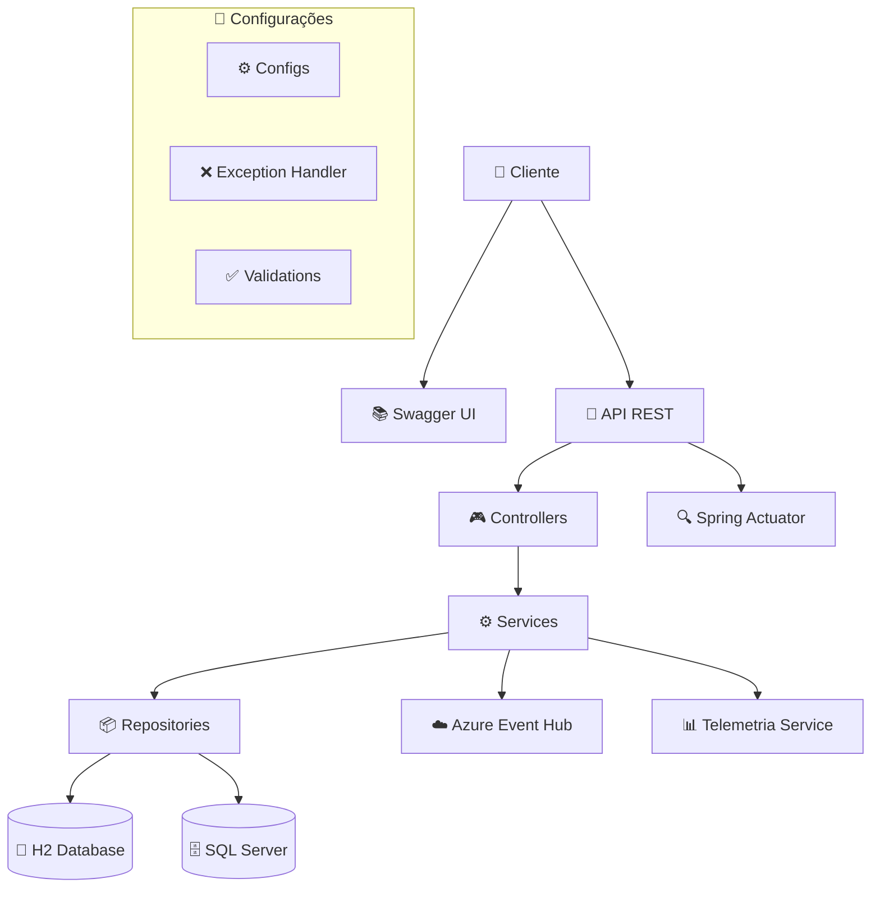

# 🏦 API Simulador de Empréstimos

<div align="center">


**API REST completa para simulação de empréstimos com sistemas SAC e PRICE**

[🚀 Demo](#-demonstração) • [📖 Documentação](#-documentação-da-api) • [🛠️ Instalação](#%EF%B8%8F-instalação) • [🐳 Docker](#-docker) • [📊 Monitoramento](#-monitoramento)

</div>

---

## 📋 Índice

- [Sobre o Projeto](#-sobre-o-projeto)
- [Funcionalidades](#-funcionalidades)
- [Tecnologias](#-tecnologias)
- [Arquitetura](#-arquitetura)
- [Instalação](#%EF%B8%8F-instalação)
- [Configuração](#%EF%B8%8F-configuração)
- [Docker](#-docker)
- [Documentação da API](#-documentação-da-api)
- [Endpoints](#-endpoints)
- [Monitoramento](#-monitoramento)
- [Testes](#-testes)
- [Deploy](#-deploy)
- [Contribuição](#-contribuição)
- [Licença](#-licença)

---

## 🎯 Sobre o Projeto

A **API Simulador de Empréstimos** é uma solução robusta desenvolvida para o **Hackathon**, oferecendo simulações financeiras precisas usando os sistemas de amortização **SAC** (Sistema de Amortização Constante) e **PRICE** (Sistema Francês de Amortização).

### 🏆 Características Principais

- ✅ **Cálculos Financeiros Precisos**: Implementação matemática rigorosa dos sistemas SAC e PRICE
- ✅ **Arquitetura Escalável**: Microserviços com múltiplas fontes de dados
- ✅ **Observabilidade Completa**: Telemetria, métricas e monitoramento integrado
- ✅ **Documentação Interativa**: Swagger/OpenAPI 3.0 completo
- ✅ **Deploy Cloud-Ready**: Configurado para Azure com Docker

---

## ⚡ Funcionalidades

### 🧮 **Simulações Financeiras**
- **Sistema SAC**: Parcelas decrescentes com amortização constante
- **Sistema PRICE**: Parcelas fixas com amortização crescente
- **Validações Automáticas**: Valores mínimos e prazos válidos
- **Persistência Inteligente**: Armazenamento em SQL Server e H2

### 📊 **Relatórios e Consultas**
- **Listagem Paginada**: Histórico completo de simulações
- **Consultas por Data**: Volume agregado por período
- **Análise por Produto**: Métricas segmentadas
- **Exportação de Dados**: Formatos JSON estruturados

### 🔍 **Monitoramento e Telemetria**
- **Métricas de Performance**: Tempo de resposta por endpoint
- **Volume de Operações**: Contadores de requisições
- **Taxa de Sucesso**: Monitoramento de falhas
- **Integração Azure**: Event Hub para telemetria

### 🛡️ **Segurança e Qualidade**
- **Validação Robusta**: Bean Validation (JSR-303)
- **Tratamento de Erros**: Respostas padronizadas
- **Logs Estruturados**: Rastreabilidade completa
- **Health Checks**: Monitoramento de saúde da aplicação

---

## 🛠️ Tecnologias

### **Backend**
- **Java 17** - LTS com performance otimizada
- **Spring Boot 3.5.5** - Framework principal
- **Spring Data JPA** - Persistência de dados
- **Spring Validation** - Validação de entrada

### **Bancos de Dados**
- **SQL Server (Azure)** - Dados principais de produção
- **H2 Database** - Simulações em memória

### **Documentação**
- **SpringDoc OpenAPI 3** - Documentação interativa
- **Swagger UI** - Interface de testes
- **Postman Collection** - Coleção completa com todos os endpoints e testes automáticos

### **Observabilidade**
- **Spring Actuator** - Health checks e métricas
- **Azure Event Hub** - Telemetria em tempo real

### **Deploy e DevOps**
- **Docker** - Containerização
- **Docker Compose** - Orquestração local
- **Maven** - Gerenciamento de dependências
- **Azure** - Cloud hosting

---

## 🏗️ Arquitetura



### **Camadas da Aplicação**

1. **Presentation Layer** - Controllers REST com documentação Swagger
2. **Business Layer** - Services com lógica de negócio e cálculos financeiros
3. **Data Layer** - Repositories para múltiplas fontes de dados
4. **Configuration Layer** - Configurações de infraestrutura e segurança

---

## ⚙️ Instalação

### **Pré-requisitos**

- ☕ **Java 17+** - [Download OpenJDK](https://adoptopenjdk.net/)
- 📦 **Maven 3.9+** - [Download Maven](https://maven.apache.org/download.cgi)
- 🐳 **Docker** (opcional) - [Download Docker](https://www.docker.com/get-started)
- ☁️ **Conta Azure** (para produção) - [Azure Portal](https://portal.azure.com/)

### **1. Clonar o Repositório**

```bash
git clone https://github.com/leofaria-code/api-simulador.git
cd api-simulador
```

### **2. Configurar Variáveis de Ambiente**

```bash
# Copiar o arquivo de exemplo
cp .env.example .env

# Editar as configurações
nano .env
```

### **3. Instalar Dependências**

```bash
mvn clean install
```

### **4. Executar a Aplicação**

```bash
mvn spring-boot:run
```

### **5. Verificar a Instalação**

```bash
# Health Check
curl http://localhost:8080/actuator/health

# Swagger UI
open http://localhost:8080/swagger-ui.html
```

### **🚀 Quick Start - Primeiros Passos**

Após a instalação, você pode testar a API de 3 formas:

#### **1. 📖 Swagger UI (Recomendado para desenvolvedores)**
- Acesse: http://localhost:8080/swagger-ui.html
- Interface completa com documentação interativa
- Teste todos os endpoints diretamente no navegador

#### **2. 📁 Postman Collection (Recomendado para testes)**
- Importe o arquivo: `api-simulador-PostmanCollection.json`
- Coleção completa com **todos os endpoints**
- **Testes automáticos** incluídos
- Variables configuradas para dev e produção

#### **3. 🔧 cURL (Para automação)**
```bash
# Exemplo: Criar uma simulação
curl -X POST "http://localhost:8080/simulacoes" \
  -H "Content-Type: application/json" \
  -d '{"valorDesejado": 10000, "prazo": 24}'
```

💡 **Dica**: Use a **Postman Collection** para uma experiência completa com testes automáticos!

---

## 🔧 Configuração

### **Arquivo `.env`**

```bash
# 🗄️ SQL Server (Produção)
DB_URL=seu-servidor-azure.database.windows.net
DB_PORT=1433
DB_NAME=hackathon_db
DB_USERNAME=seu_usuario
DB_PASSWORD=sua_senha_super_secreta

# 💾 H2 Database (Desenvolvimento)
H2_URL=jdbc:h2:mem:simulacao
H2_USERNAME=sa
H2_PASSWORD=password

# ☁️ Azure Event Hub
AZURE_EVENTHUB_CONNECTION_STRING=Endpoint=sb://...
AZURE_EVENTHUB_ENTITY_PATH=simulacoes
AZURE_EVENTHUB_NAME=simulacoes-hub

# ⚙️ Configurações Gerais
SERVER_PORT=8080
SHOW_SQL=false
```

### **Perfis de Ambiente**

```bash
# Desenvolvimento
mvn spring-boot:run

# Produção
mvn spring-boot:run -Dspring-boot.run.profiles=prod

# Testes
mvn spring-boot:run -Dspring-boot.run.profiles=test
```

---

## 🐳 Docker

### **Build Local**

```bash
# Construir a imagem
docker build -t api-simulador:latest .

# Executar container
docker run -p 8080:8080 --env-file .env api-simulador:latest
```

### **Docker Compose**

```bash
# Subir todos os serviços
docker-compose up -d

# Ver logs
docker-compose logs -f api-simulador

# Parar serviços
docker-compose down
```

### **Arquivos Docker**

- `Dockerfile` - Imagem da aplicação
- `docker-compose.yml` - Orquestração completa
- `.dockerignore` - Exclusões do build

---

## 📖 Documentação da API

### **Swagger UI**
🌐 **Acesso**: http://localhost:8080/swagger-ui.html

### **OpenAPI Spec**
📄 **JSON**: http://localhost:8080/api-docs  
📄 **YAML**: http://localhost:8080/api-docs.yaml

### **Coleção Postman Completa**
📁 **Arquivo**: `api-simulador-PostmanCollection.json`

🚀 **Coleção atualizada com todos os endpoints:**
- ✅ **Simulações completas** - Criar, listar e analisar simulações
- ✅ **Monitoramento avançado** - Telemetria e métricas de performance
- ✅ **Azure Event Hub** - Testes de conectividade e status
- ✅ **Health checks** - Endpoints do Spring Actuator
- ✅ **Documentação completa** - Descrições detalhadas de cada endpoint
- ✅ **Testes automáticos** - Scripts de validação incluídos
- ✅ **Variáveis de ambiente** - Configuração para dev e produção

📥 **Para importar no Postman:**
1. Abra o Postman
2. Clique em "Import"
3. Selecione o arquivo `api-simulador-PostmanCollection.json`
4. Configure a variável `base_url` se necessário

---

## 🔗 Endpoints

### 🏦 **Simulações**

| Método | Endpoint | Descrição | Parâmetros | Auth |
|--------|----------|-----------|------------|------|
| `POST` | `/simulacoes` | Criar nova simulação | `valorDesejado`, `prazo` | - |
| `GET` | `/simulacoes` | Listar simulações (paginado) | `pagina`, `tamanho` | - |
| `GET` | `/simulacoes/dia/{data}` | Volume por data específica | `data` (path) | - |

### 📊 **Monitoramento e Telemetria**

| Método | Endpoint | Descrição | Parâmetros | Auth |
|--------|----------|-----------|------------|------|
| `GET` | `/monitoramento/telemetria` | Métricas da aplicação | `dataReferencia` | - |
| `GET` | `/monitoramento/eventhub-status` | Status do Azure Event Hub | - | - |
| `POST` | `/monitoramento/test-eventhub` | Testar conexão Event Hub | - | - |

### 🔍 **Health & Metrics**

| Método | Endpoint | Descrição | Auth |
|--------|----------|-----------|------|
| `GET` | `/actuator/health` | Status da aplicação | - |
| `GET` | `/actuator/metrics` | Métricas detalhadas | - |

### **Exemplos de Uso**

#### **📝 Criar Simulação**

```bash
curl -X POST "http://localhost:8080/simulacoes" \
  -H "Content-Type: application/json" \
  -d '{
    "valorDesejado": 10000.00,
    "prazo": 24
  }'
```

#### **📋 Listar Simulações**

```bash
curl "http://localhost:8080/simulacoes?pagina=0&tamanho=50"
```

#### **📅 Volume por Data**

```bash
curl "http://localhost:8080/simulacoes/dia/2025-08-25"
```

#### **📊 Telemetria e Monitoramento**

```bash
# Obter telemetria formatada
curl "http://localhost:8080/monitoramento/telemetria?dataReferencia=2025-08-25"

# Verificar status do Azure Event Hub
curl "http://localhost:8080/monitoramento/eventhub-status"

# Testar conexão com Event Hub
curl -X POST "http://localhost:8080/monitoramento/test-eventhub"
```

---

## 📊 Monitoramento

### **Health Checks**

```bash
# Status geral
curl http://localhost:8080/actuator/health

# Informações da aplicação
curl http://localhost:8080/actuator/info
```

### **Telemetria Customizada**

```bash
# Telemetria da aplicação
curl "http://localhost:8080/monitoramento/telemetria?dataReferencia=2025-08-25"
```

### **Azure Event Hub Integration**

```bash
# Status da integração
curl "http://localhost:8080/monitoramento/eventhub-status"

# Teste de conectividade
curl -X POST "http://localhost:8080/monitoramento/test-eventhub" \
  -H "Content-Type: application/json"
```

**Resposta de exemplo (Event Hub funcionando):**
```json
{
  "status": "SUCCESS",
  "message": "Mensagem de teste enviada com sucesso para Azure Event Hub",
  "timestamp": "2025-08-25T10:30:00.123456",
  "eventhub_configured": true
}
```

---

## 🧪 Testes

### **Executar Testes**

```bash
# Todos os testes
mvn test

# Testes específicos
mvn test -Dtest=SimulacaoServiceTest

# Testes com relatório
mvn test jacoco:report
```

### **Testes Automatizados**

- ✅ **Testes Unitários** - Services e utilitários
- ✅ **Testes de Integração** - Controllers e repositories
- ✅ **Testes de Contrato** - APIs e schemas

### **Scripts de Teste**

```bash
# PowerShell - Teste da API
./teste-api.ps1

# PowerShell - Teste de formato
./teste-formato.ps1

# PowerShell - Testar EventHub
./testar-simulacoes-eventhub.ps1
```

### **🔧 Testes com Postman**

A coleção Postman inclui **testes automáticos** para todos os endpoints:

📁 **Arquivo**: `api-simulador-PostmanCollection.json`

#### **Testes incluídos:**
- ✅ Validação de status code (200/201)
- ✅ Verificação de Content-Type JSON
- ✅ Validação de tempo de resposta (<5s)
- ✅ Estrutura de dados das respostas

#### **Como executar:**
1. **Importe a coleção** no Postman
2. **Configure a variável** `base_url = http://localhost:8080`
3. **Execute Collection Runner** para testes automatizados
4. **Visualize os resultados** de todos os endpoints

#### **Exemplo de uso avançado:**
```javascript
// Testes personalizados incluídos na coleção
pm.test('Simulação retorna SAC e PRICE', function () {
    const response = pm.response.json();
    pm.expect(response).to.have.property('simulacaoSAC');
    pm.expect(response).to.have.property('simulacaoPRICE');
});
```

#### **Variáveis disponíveis:**
- `base_url` - URL da API (dev: localhost:8080)
- `base_url_prod` - URL de produção (Azure)

💡 **Dica**: Use o **Collection Runner** do Postman para executar todos os testes de uma vez e gerar relatórios automatizados!

---

## 🚀 Deploy

### **Azure App Service**

1. **Criar Resource Group**
```bash
az group create --name hackathon-rg --location brazilsouth
```

2. **Criar App Service Plan**
```bash
az appservice plan create --name hackathon-plan --resource-group hackathon-rg --sku B1 --is-linux
```

3. **Deploy da Aplicação**
```bash
az webapp create --resource-group hackathon-rg --plan hackathon-plan --name api-simulador-hackathon --runtime "JAVA|17-java17"
```

### **Azure Container Instances**

```bash
# Build e push para Azure Container Registry
az acr build --registry myregistry --image api-simulador:latest .

# Deploy no ACI
az container create --resource-group hackathon-rg --name api-simulador --image myregistry.azurecr.io/api-simulador:latest
```

### **Variáveis de Ambiente - Produção**

Configurar no Azure Portal ou via CLI:

```bash
az webapp config appsettings set --resource-group hackathon-rg --name api-simulador-hackathon --settings \
  "DB_URL=servidor.database.windows.net" \
  "DB_USERNAME=usuario" \
  "DB_PASSWORD=senha" \
  "AZURE_EVENTHUB_CONNECTION_STRING=conexao"
```

---

## 📈 Performance e Escalabilidade

### **Configurações de Performance**

- **Pool de Conexões**: HikariCP otimizado
- **Cache JPA**: Second-level cache configurado  
- **Lazy Loading**: Queries otimizadas
- **Paginação**: Limitação de resultados

### **Métricas de Performance**

- **Tempo de Resposta**: < 200ms para simulações
- **Throughput**: > 1000 req/s
- **Memória**: 512MB máximo (container)
- **CPU**: 2 cores recomendados

---

## 🤝 Contribuição

### **Como Contribuir**

1. **Fork** o projeto
2. **Crie** uma branch feature (`git checkout -b feature/AmazingFeature`)
3. **Commit** suas mudanças (`git commit -m 'Add some AmazingFeature'`)
4. **Push** para a branch (`git push origin feature/AmazingFeature`)
5. **Abra** um Pull Request

### **Padrões de Código**

- ✅ **Java Code Style**: Google Java Style Guide
- ✅ **Commits**: Conventional Commits
- ✅ **Documentação**: JavaDoc obrigatório
- ✅ **Testes**: Cobertura mínima 80%

### **Issues e Bugs**

Use os templates disponíveis em `.github/ISSUE_TEMPLATE/`

---

## 📝 Licença

Este projeto está licenciado sob a **Apache License 2.0** - veja o arquivo [LICENSE](LICENSE) para detalhes.

---

## 👨‍💻 Autor

<div align="center">

**Leonardo Faria**

[](https://github.com/leofaria-code)
[](mailto:leofaria.email@gmail.com)
[](https://www.linkedin.com/in/leofaria-code)

</div>

---

## 🙏 Agradecimentos

- **Hackathon Team** - Pela oportunidade e desafio
- **Spring Community** - Pelo framework excepcional  
- **Azure Team** - Pela infraestrutura cloud
- **Open Source Community** - Pelas bibliotecas utilizadas

---

<div align="center">

**⭐ Se este projeto foi útil, deixe uma estrela!**

**🚀 Desenvolvido com ❤️ para o Hackathon 2024**

</div>
